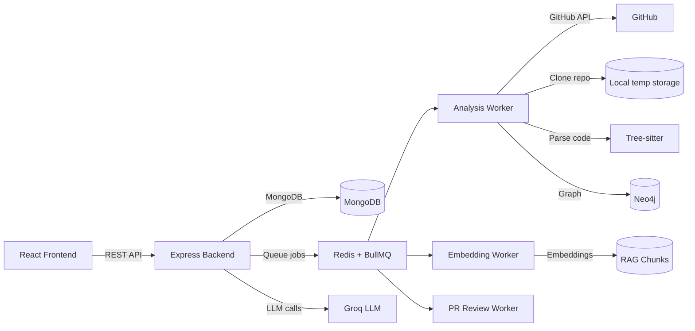

# EDAI Code Analyzer

EDAI is a full-stack code intelligence platform that analyzes GitHub repositories and pull requests, builds a knowledge graph and semantic index, and delivers AI-powered onboarding, codebase chat, and PR review insights.

It is built as a React frontend and a Node.js backend with background workers and multiple data stores for analysis, embeddings, and graph data.

## Highlights

- Repository analysis with GitHub metadata, commits, parsed files, functions, and dependencies
- Knowledge graph generation in Neo4j for relationships across files, functions, and contributors
- AI onboarding summaries for repo, files, and functions
- Codebase chat with retrieval-augmented generation (RAG) and source references
- PR review assistant that evaluates changes and returns structured findings
- Export analysis to PDF and share results via public links

## Architecture



## Workflow Overview

### 1) Repository Analysis

1. User submits a GitHub repo URL from the Analyze page.
2. Backend creates an analysis record and enqueues a job.
3. Analysis worker fetches GitHub metadata, clones the repo, extracts commits, scans code files, and parses the AST.
4. The worker builds a knowledge graph and saves results to MongoDB.
5. Embedding worker chunks code into semantic units and stores embeddings for chat.
6. Frontend polls status until analysis is complete, then displays results.

### 2) AI Insights

1. User triggers AI insights from the Results page.
2. Backend generates repo, file, function, and commit insights via LLM.
3. Insights are cached in the analysis document for quick reloads.

### 3) Codebase Chat (RAG)

1. Embeddings are generated for chunks from parsed files.
2. User asks questions in the chat UI.
3. The backend retrieves the most relevant chunks and asks the LLM for an answer.
4. The response includes citations to files and functions.

### 4) PR Review Assistant

1. User submits a GitHub PR URL.
2. Backend queues a PR review job.
3. The worker fetches PR metadata, diffs, and files, then generates AI review findings.
4. Results are returned with severity and category groupings.

## Tech Stack

**Frontend**
- React + Vite
- React Router
- Axios
- Tailwind CSS
- Recharts

**Backend**
- Node.js + Express
- MongoDB (Mongoose)
- Neo4j
- Redis + BullMQ
- Tree-sitter parsers
- Groq LLM API
- Octokit GitHub API

## Key Modules

- API entry: [backend/src/app.js](backend/src/app.js)
- Auth: [backend/src/routes/auth.routes.js](backend/src/routes/auth.routes.js), [backend/src/controllers/auth.controller.js](backend/src/controllers/auth.controller.js)
- Repo analysis: [backend/src/controllers/repo.controller.js](backend/src/controllers/repo.controller.js)
- Chat: [backend/src/controllers/chat.controller.js](backend/src/controllers/chat.controller.js)
- Analysis worker: [backend/src/jobs/analysisWorker.js](backend/src/jobs/analysisWorker.js)
- Embeddings worker: [backend/src/jobs/embeddingWorker.js](backend/src/jobs/embeddingWorker.js)
- PR review worker: [backend/src/jobs/prReviewWorker.js](backend/src/jobs/prReviewWorker.js)
- RAG logic: [backend/src/services/ragService.js](backend/src/services/ragService.js)
- GitHub integration: [backend/src/services/githubService.js](backend/src/services/githubService.js)
- Knowledge graph: [backend/src/services/graphService.js](backend/src/services/graphService.js)
- Frontend routes: [frontend/src/App.jsx](frontend/src/App.jsx)
- Results UI: [frontend/src/pages/Results.jsx](frontend/src/pages/Results.jsx)
- Chat UI: [frontend/src/components/dashboard/CodebaseChat.jsx](frontend/src/components/dashboard/CodebaseChat.jsx)

## Folder Structure

```
backend/
	src/
		app.js
		config/
		controllers/
		jobs/
		middleware/
		models/
		routes/
		services/
	temp/

frontend/
	src/
		api/
		components/
		context/
		hooks/
		pages/
```

## API Surface (High-level)

- POST /api/auth/register
- POST /api/auth/login
- GET  /api/auth/me
- POST /api/repo/metadata
- POST /api/repo/analyze
- GET  /api/repo/status/:analysisId
- GET  /api/repo/result/:analysisId
- GET  /api/repo/my-analyses
- POST /api/repo/ai-insights
- POST /api/repo/export-pdf
- POST /api/repo/create-share-link
- POST /api/repo/pr-review
- GET  /api/repo/pr-review/:id
- POST /api/chat/:analysisId
- GET  /api/chat/:analysisId/status
- GET  /api/chat/:analysisId/suggestions

## Environment Variables

Define these in backend/.env before running the server:

- `PORT`
- `MONGO_URI`
- `JWT_SECRET`
- `JWT_EXPIRES_IN`
- `GITHUB_TOKEN`
- `GROQ_API_KEY`
- `NEO4J_URI`
- `NEO4J_USER`
- `NEO4J_PASSWORD`
- `REDIS_HOST`
- `REDIS_PORT`
- `REDIS_PASSWORD`
- `REDIS_TLS`
- `BACKEND_URL`

## Local Development

### Backend

```bash
cd backend
npm install
npm run dev
```

### Frontend

```bash
cd frontend
npm install
npm run dev
```

## What to Read First

1. [backend/src/app.js](backend/src/app.js) for the API entry point and worker bootstrapping.
2. [backend/src/controllers/repo.controller.js](backend/src/controllers/repo.controller.js) for the full analysis flow.
3. [backend/src/jobs/analysisWorker.js](backend/src/jobs/analysisWorker.js) and [backend/src/jobs/embeddingWorker.js](backend/src/jobs/embeddingWorker.js) for the background pipeline.
4. [frontend/src/pages/Results.jsx](frontend/src/pages/Results.jsx) to understand how analysis data is presented.

## Notes

- Analysis and embeddings run asynchronously; the UI polls status until ready.
- Public share links render a read-only HTML summary.
- PR review is limited by file count and patch size for performance.

---

If you want, I can also add badges, screenshots, or a deployment section.
